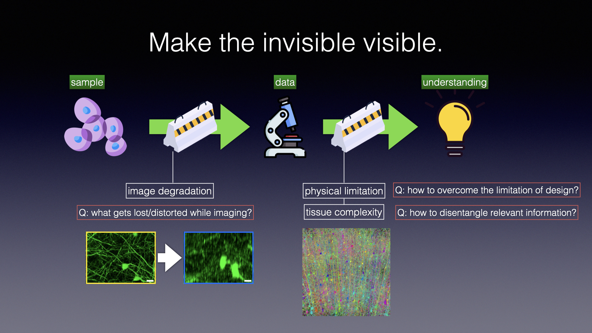

Welcome to the personal webpage of Hyoungjun "Peter" Park!

What drives me
======
I am a neuroscientist who is passionate about seeing beyond physical limitations of our instruments to arrive at a new biological discovery. 
To achieve this, I use deep learning to enhance the signal processing and the reconstruction of image data. Why use deep learning? When we image
or measure something, data gets lost or distorted by a complex mixture of many factors, which are often difficult to unravel. 
Deep learning is a very effective and flexible solution searching method for such tasks, especially, ill-posed problems. 

So far, my research has been in fluorescence microscopy. In my latest project, I have implemented a novel unsupervised learning
method to achieve isotropic resolution for volumetric fluorescence microscopy without any external references 
(meaning, we only train and test with one sample). I am interested in branching out to other modalities and further test and
develop this framework: e.g. medical imaging modalities and holotomography.  

Where I was
======
I received my bacheor's degree in Brain and Cognitive Sciences at the Massachusetts Institute of Technology (MIT), and I received 
my master's degree in Neural Systems and Computation at ETH Zürich and University of Zürich. I did my master thesis work under the
supervision of Dr. [Marcel Oberlaender](https://mpinb.mpg.de/en/research-groups/groups/in-silico-brain-sciences/group-leader.html) at the Max Planck Institute 
of Neurobiology of Behavior. 

After finishing the master's degree, I returned to my home country (South Korea) due to conscription as a South Korean citizen. 
I was fortunate enough to work in scientific research to fulfil the mandatory military service of three years.
For the last three years, I worked as a research scientist under supervision of Prof. [Jong Chul Ye](https://bispl.weebly.com/professor.html)
at the Korea Advanced Institute of Science and Technology. I was part of a multi-institutional initiative to lay technical foundations for 
South Korea’s connectome project. As the project manager of my research division, I spearheaded the development of deep learning 
methods to enhance microscopy resolution and automate the segmentation of neuronal populations. 
This project helped me to mature into an independent researcher with an interdisciplinary background in 
neuroscience and deep learning.

Where I am
======
I have successfully finished the military service, and I look forward to doing more research! I am planning to move back 
to Europe to pursue a doctoral program. If you happen to know any PI who shares my research interest, please let me know!
