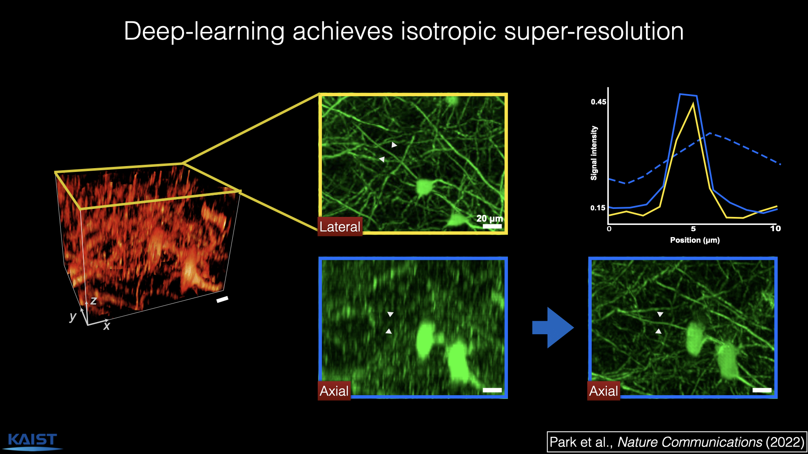
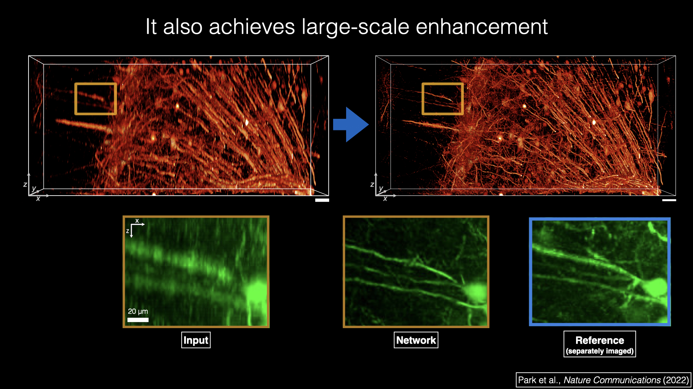
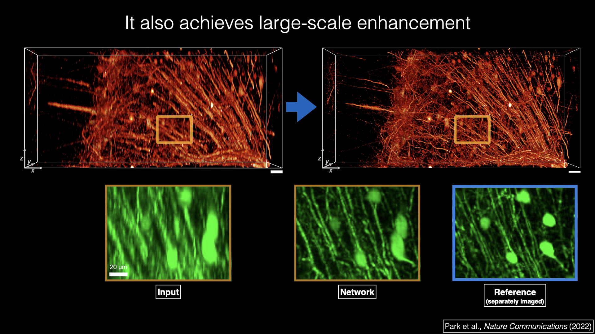
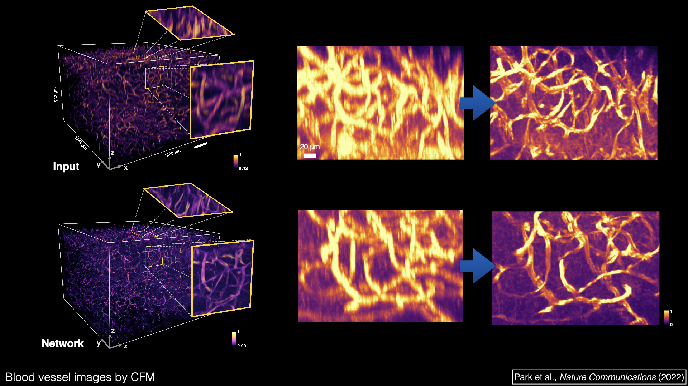
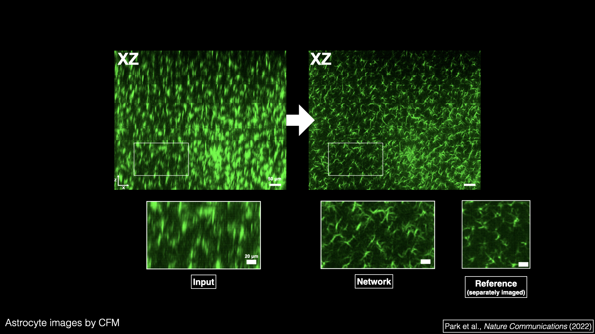

Authors: **Hyoungjun Park**, Myeongsu Na, Bumju Kim, Soohyun Park, Ki Hean Kim, Sunghoe Chang, and Jong Chul Ye

Abstract: Volumetric imaging by fluorescence microscopy is often limited by anisotropic spatial resolution, in which the axial 
resolution is inferior to the lateral resolution. To address this problem, we present a deep-learning-enabled unsupervised 
super-resolution technique that enhances anisotropic images in volumetric fluorescence microscopy. In contrast to the 
existing deep learning approaches that require matched high-resolution target images, our method greatly reduces the 
effort to be put into practice as the training of a network requires only a single 3D image stack, without a priori 
knowledge of the image formation process, registration of training data, or separate acquisition of target data. This 
is achieved based on the optimal transport-driven cycle-consistent generative adversarial network that learns from an 
unpaired matching between high-resolution 2D images in the lateral image plane and low-resolution 2D images in other 
planes. Using fluorescence confocal microscopy and light-sheet microscopy, we demonstrate that the trained network 
not only enhances axial resolution but also restores suppressed visual details between the imaging planes and removes 
imaging artifacts.

[Download paper here](https://www.nature.com/articles/s41467-022-30949-6)

