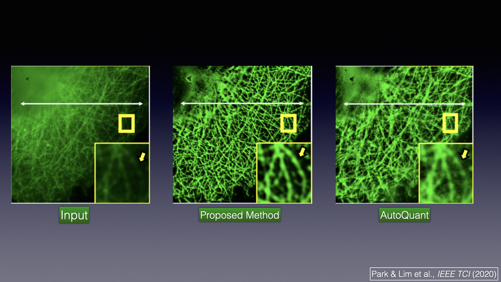

Authors: Sungjun Lim*, Hyoungjun Park*, Sang-Eun Lee, Sunghoe Chang, Byeongsu Sim, and Jong Chul Ye

*: equal contribution

Abstract: Deconvolution microscopy has been extensively used to improve the resolution of the wide-field fluorescent microscopy, 
but the performance of classical approaches critically depends on the accuracy of a model and optimization algorithms. 
Recently, the convolutional neural network (CNN) approaches have been studied as a fast and high performance alternative. 
Unfortunately, the CNN approaches usually require matched high resolution images for supervised training. In this article, 
we present a novel unsupervised cycle-consistent generative adversarial network (cycleGAN) with a linear blur kernel, which 
can be used for both blind- and non-blind image deconvolution. In contrast to the conventional cycleGAN approaches that 
require two deep generators, the proposed cycleGAN approach needs only a single deep generator and a linear blur kernel, 
which significantly improves the robustness and efficiency of network training. We show that the proposed architecture 
is indeed a dual formulation of an optimal transport problem that uses a special form of the penalized least squares cost 
as a transport cost. Experimental results using simulated and real experimental data confirm the efficacy of the algorithm.

[Download paper here](https://ieeexplore.ieee.org/document/9136890)